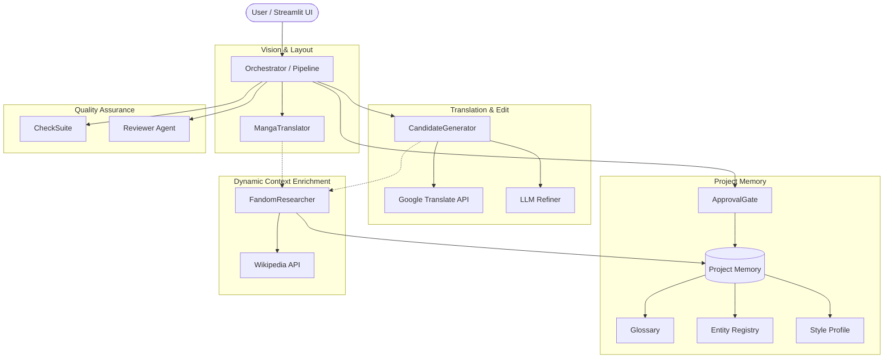

# DRS v3 Localization System Architecture

This document describes the high-level system architecture and components of the Dynamic Translation and Refining System (DRS v3).

---

## 1. Component Overview Diagram

---

## 2. Core Agent Roles & Responsibilities

DRS v3 strictly follows the **Single Responsibility Principle** to ensure there is no job overlap between the different AI agents:

### 1. Vision & Layout Agent (`MangaTranslator`)
* **Scope**: Multi-modal vision and image layout analysis.
* **Responsibilities**:
  * Scans manga/game screenshots to detect text boxes, coordinate coordinates, and speech bubble layouts.
  * Runs OCR to extract the original raw text.
  * Evaluates rendered pages for visual typesetting quality (alignment, text overflow, line wrapping).
* **Code**: `core/agents/manga_translator.py`

### 2. Translation & Polishing Agent (`CandidateGenerator`)
* **Scope**: High-performance, memory-compliant text translation and editing.
* **Responsibilities**:
  * Executes the **Hybrid Translation Flow**: fetches a raw, instant translation draft via Google Translate, then uses a primary LLM to refine and polish it using project memory.
  * Performs batch-refinement of text blocks extracted from manga pages.
* **Code**: `core/agents/candidate_generator.py`

### 3. Review & Critic Agent (`Reviewer`)
* **Scope**: Automated correction of rule violations and soft style consistency reviews.
* **Responsibilities**:
  * Corrects glossary violations or styling errors flagged by the rule-based checker.
  * Assesses tone, honorifics, and character voice consistency.
* **Code**: `core/agents/reviewer.py`

### 4. Context Seeding & Research Agent (`FandomResearcher`)
* **Scope**: Automated context gathering.
* **Responsibilities**:
  * Performs Wikipedia queries for any input topic (e.g. game fandom, historical figure, scientific field) to fetch background context.
  * Automatically populates the glossary, entities, and style guidelines using LLM synthesis of the retrieved wiki content.
  * Executes **Background Context Enrichment**: extracts new proper nouns from translated text and researches them on Wikipedia in the background without blocking the translation thread.
* **Code**: `core/agents/fandom_researcher.py`

---

## 3. Modular Prompt Management

All system and user prompts are managed outside the codebase as markdown files to allow easy tuning and modifications without touching the Python implementation.

### Folder Structure
* `config/prompts/`
  * [`candidate_generator_system.md`](file:///d:/Gitcode/drs-v3/config/prompts/candidate_generator_system.md): System prompt for the translation editor.
  * [`candidate_generator_user.md`](file:///d:/Gitcode/drs-v3/config/prompts/candidate_generator_user.md): Prompt structure for raw translations.
  * [`reviewer_system.md`](file:///d:/Gitcode/drs-v3/config/prompts/reviewer_system.md): System prompt for the reviewer.
  * [`reviewer_user.md`](file:///d:/Gitcode/drs-v3/config/prompts/reviewer_user.md): Prompt structure for correction reports.
  * `mods/`: Genre and topic-specific system prompt modifiers (automatically appended based on the project's content type):
    * [`manga.md`](file:///d:/Gitcode/drs-v3/config/prompts/mods/manga.md): Concise translation guidelines, colloquial dialogue rules.
    * [`history.md`](file:///d:/Gitcode/drs-v3/config/prompts/mods/history.md): Academic tone, historical spelling, title rules.
    * [`mythology.md`](file:///d:/Gitcode/drs-v3/config/prompts/mods/mythology.md): Epic tone, divine titles, archaic terms.
    * [`scientific.md`](file:///d:/Gitcode/drs-v3/config/prompts/mods/scientific.md): Technical terminology, factual precision.

---

## 4. REST API Gateway

To integrate with modern web frontends (e.g., Next.js), the system exposes a clean, modular REST API layer:

* **Entrypoint**: `interfaces/api.py` (a shortcut forwarding to the server module)
* **API Modules (`server/`)**:
  * [`server/main.py`](file:///d:/Gitcode/drs-v3/server/main.py): Sets up the FastAPI application, mounts CORS middlewares, and aggregates routers.
  * [`server/schemas.py`](file:///d:/Gitcode/drs-v3/server/schemas.py): Houses all Pydantic request and response models.
  * `server/routers/`:
    * [`projects.py`](file:///d:/Gitcode/drs-v3/server/routers/projects.py): Project management routes (`GET/POST`).
    * [`translation.py`](file:///d:/Gitcode/drs-v3/server/routers/translation.py): Pipeline execution and session approval.
    * [`memory.py`](file:///d:/Gitcode/drs-v3/server/routers/memory.py): Memory query registry and Wikipedia seeding.
    * [`auth.py`](file:///d:/Gitcode/drs-v3/server/routers/auth.py): Authentication endpoints (`/register`, `/login`, `/logout`, `/me`).
  * [`server/auth.py`](file:///d:/Gitcode/drs-v3/server/auth.py): Password hashing (PBKDF2-HMAC-SHA256) and dependency-free HS256 JWT signature generator.

* **Key Features**:
  * **CORS Enabled**: Configured to connect seamlessly to Next.js clients.
  * **Asynchronous Pipeline Integration**: Translates interactive CLI callbacks into stateful, session-based HTTP requests (`/api/translation/translate` ➔ `/api/translation/approve`).
  * **Background Seeding**: Run background FandomResearcher tasks without blocking HTTP client threads.
  * **Token Authentication & Security**: Secure endpoints require a valid OAuth2 Bearer Token. All passwords stored in `memory_store/users.json` are salted and hashed. Logged-out tokens are blacklisted in memory.
