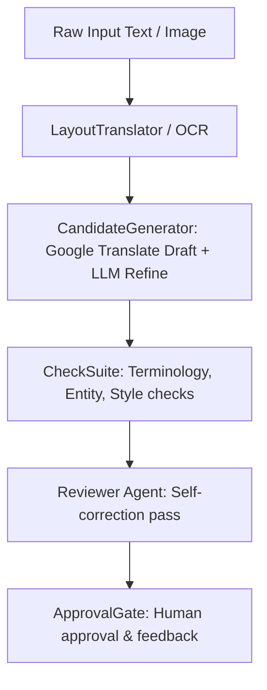

# DRS v3 Backend Agents Documentation

This document serves as the complete technical handoff handbook for the AI Agents component of the Dynamic Translation and Refining System (DRS v3). It details the roles, processing steps, and prompt structures for each dedicated agent.

---

## 1. Agent Directory Tree

The AI agents reside under `core/agents/` and prompt configuration files reside under `config/prompts/`:

```text
drs-v3/
├── core/
│   └── agents/
│       ├── __init__.py            # Module exports
│       ├── candidate_generator.py # Translation engine (Hybrid translation)
│       ├── fandom_researcher.py   # Context gathering and background search
│       ├── feedback_extractor.py  # Diff analysis & correction identification
│       ├── layout_translator.py   # Multi-modal layout analyzer & OCR checker
│       └── reviewer.py            # Critic agent fixing rule violations
└── config/
    └── prompts/
        ├── candidate_generator_system.md  # Main translation system prompt
        ├── candidate_generator_user.md    # Formatter for raw translation
        ├── reviewer_system.md             # Reviewer system instructions
        ├── reviewer_user.md               # Format for correction reports
        └── mods/                          # Genre-specific system prompt modifiers
            ├── history.md                 # Academic tone and spelling
            ├── manga.md                   # Dialogue constraints and speed bubbles
            ├── mythology.md               # Epic naming conventions
            └── scientific.md              # Technical terminologies
```

---

## 2. Core Agent Roles & Processing Flows



### 1. `LayoutTranslator` (Vision & Image Layout Agent)
- **Class**: `LayoutTranslator`
- **Location**: `core/agents/layout_translator.py`
- **Model**: Vision-capable models (e.g., `google/gemini-flash-1.5:free` on OpenRouter).
- **Processing Flow**:
  1. **OCR & Layout Extraction**: Receives image bytes (PNG/JPG), encodes to base64, and sends to the multimodal LLM to detect bounding boxes of text panels, OCR the raw text, and classify text region types (`normal`, `thought`, `scream`, `narration`).
  2. **Translation & Type Wrapping**: Initiates fast raw translations via Google Translate, then applies the appropriate font properties for each block.
  3. **Visual QA Check**: Takes the original image and the rendered output image side-by-side. Compares the layout to verify text centering, overflows, clip-offs, and font tones, returning a concise markdown review report.

### 2. `CandidateGenerator` (Translation & Polishing Agent)
- **Class**: `CandidateGenerator`
- **Location**: `core/agents/candidate_generator.py`
- **Model**: Default `openrouter/owl-alpha` or customizable generator LLM.
- **Processing Flow**:
  1. **Raw Translate**: Queries the Google Translate API for a fast initial translation of the source text.
  2. **Prompt Construction**: Fetches the core system prompt (`config/prompts/candidate_generator_system.md`), appends the specific content-type modifier from `config/prompts/mods/` (e.g., `manga.md`), and injects active **Project Memory** (glossary terms, character entities, style rules).
  3. **Refine**: Prompts the LLM with the source text, raw Google Translate draft, and project memory to write a polished final translation.

### 3. `Reviewer` (Quality Assurance & Self-Correction Agent)
- **Class**: `Reviewer`
- **Location**: `core/agents/reviewer.py`
- **Model**: Default `openrouter/owl-alpha` or reviewer LLM.
- **Processing Flow**:
  1. **Trigger**: Executes only if the rule-based `CheckSuite` flags styling, entity, or glossary violations.
  2. **Critique Pass**: Takes the original source, candidate draft, and validation issue list, correcting all flagged mistakes while preserving the translator's style.

### 4. `FandomResearcher` (Wikipedia Seeding Agent)
- **Class**: `FandomResearcher`
- **Location**: `core/agents/fandom_researcher.py`
- **Processing Flow**:
  1. **Search**: Queries Wikipedia API based on a project topic (e.g., "Richard I").
  2. **Synthesize**: Synthesizes the wiki contents into clean terms, entities, and style guidelines using the LLM.
  3. **Inject**: Saves the results into the project's memory registries. Runs in the background during active translations to search for unknown proper nouns without blocking user requests.

---

## 3. Dynamic Prompt Modifiers Architecture

The core of the LLM steerability is the dynamic inclusion of prompt modifiers under `config/prompts/mods/`. 

When a project is created with a specific `content_type` (e.g., `history`), the system loads the matching markdown modifier file and appends it to the base system prompt:

```python
# core/utils/prompt_loader.py
def load_generator_prompt(content_type: str) -> str:
    base_prompt = read_file("config/prompts/candidate_generator_system.md")
    mod_path = Path("config/prompts/mods") / f"{content_type}.md"
    if mod_path.exists():
        mod = mod_path.read_text(encoding="utf-8")
        return f"{base_prompt}\n\n{mod}"
    return base_prompt
```
This architecture decouples styling instructions from python code, allowing prompt engineering teams to tune agent behavior directly in markdown files.
