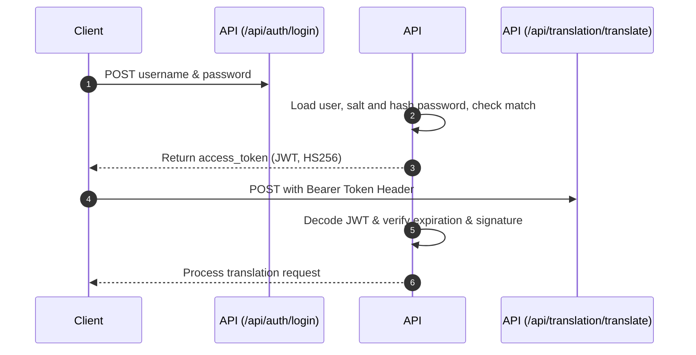

# DRS v3 Backend Server Documentation

This document serves as the complete technical handoff handbook for the REST API Server component of the Dynamic Translation and Refining System (DRS v3). It details the server directory layout, security protocols, and endpoint specifications for frontend integration.

---

## 1. Directory Tree & File Roles

The API server resides under the `server/` directory and exposes a FastAPI application:

```text
server/
├── routers/
│   ├── __init__.py          # Exports all router blueprints
│   ├── auth.py              # Auth endpoints (/register, /login, /me)
│   ├── memory.py            # Glossary, entities, style-rules & wiki seeding
│   ├── projects.py          # Project registration and metadata details
│   └── translation.py       # Main translation engine and approval sessions
├── __init__.py              # Server module initialization
├── auth.py                  # Cryptographic auth helpers & JWT verification dependency
├── main.py                  # FastAPI server entrypoint (CORS, router mounting)
└── schemas.py               # Pydantic input/output validation models (DTOs)
```

### File Responsibilities
- **`server/main.py`**: Initializes the FastAPI app, mounts `CORSMiddleware` (with configurable credentials, allowed origins, methods, and headers), and registers the routers under `/api`.
- **`server/schemas.py`**: Declares Pydantic data-transfer objects (DTOs) to validate requests on input and serialize outputs cleanly, avoiding database leakages.
- **`server/auth.py`**: Core security module. Implements password hashing (PBKDF2-HMAC-SHA256 with 600,000 iterations), custom HS256 JWT signature verification, and the `get_current_user` FastAPI dependency.
- **`server/routers/`**: Grouped API paths handling specific domains of the business logic.

---

## 2. Security & Authentication Architecture

DRS v3 implements a stateless, token-based security architecture:



### Specifications
1. **Password Hashing**: Passwords are saved under `memory_store/users.json` using salted PBKDF2-HMAC-SHA256. Plaintext is never stored.
2. **JWT Session Management**: Tokens are signed using a `JWT_SECRET_KEY` using the `HS256` algorithm. They contain token expiration times (`exp` set to 30 minutes) and the user's username (`sub`).
3. **Token Revocation (Logout)**: Tokens sent to `/api/auth/logout-token` are added to a memory-based blacklist (`REVOKED_TOKENS`) in `server/auth.py`. Blacklisted tokens are rejected immediately even if they are cryptographically valid.

---

## 3. REST API Endpoint Specifications

All endpoints require the HTTP header: `Authorization: Bearer <access_token>` except for `/api/auth/register` and `/api/auth/login`.

### Authentication Endpoints (`/api/auth`)

#### 1. Register User
- **Endpoint**: `POST /api/auth/register`
- **Request Body (`UserRegister`)**:
  ```json
  {
    "username": "admin",
    "password": "securepassword123",
    "email": "admin@example.com"
  }
  ```
- **Response**: `200 OK`
  ```json
  {
    "status": "success",
    "message": "User registered successfully"
  }
  ```

#### 2. Log In
- **Endpoint**: `POST /api/auth/login`
- **Request Body (`UserLogin`)**:
  ```json
  {
    "username": "admin",
    "password": "securepassword123"
  }
  ```
- **Response (`Token`)**:
  ```json
  {
    "access_token": "eyJhbGciOiJIUzI1NiIsInR5cCI6IkpXVCJ9...",
    "token_type": "bearer"
  }
  ```

#### 3. Current User Profile
- **Endpoint**: `GET /api/auth/me`
- **Response (`UserOut`)**:
  ```json
  {
    "username": "admin",
    "email": "admin@example.com"
  }
  ```

---

### Project Endpoints (`/api/projects`)

#### 1. List Projects
- **Endpoint**: `GET /api/projects`
- **Response**: List of `ProjectInfo`
  ```json
  [
    {
      "project_id": "test-project",
      "source_lang": "ja",
      "target_lang": "vi",
      "content_type": "manga",
      "tone_note": "Thân thiện, trẻ trung"
    }
  ]
  ```

#### 2. Create Project
- **Endpoint**: `POST /api/projects`
- **Request Body (`ProjectCreate`)**:
  ```json
  {
    "project_id": "one-piece-vi",
    "source_lang": "ja",
    "target_lang": "vi",
    "content_type": "manga",
    "tone_note": "Colloquial speech, modern slang"
  }
  ```
- **Response (`ProjectInfo`)**: Returns the created project metadata.

---

### Memory & Seeding Endpoints (`/api/memory`)

#### 1. Get Project Memory
- **Endpoint**: `GET /api/memory/{project_id}`
- **Response**:
  ```json
  {
    "glossary": [
      {
        "source_term": "先輩",
        "target_term": "senpai",
        "source_lang": "ja",
        "target_lang": "vi",
        "context_note": "Giữ nguyên"
      }
    ],
    "entities": [],
    "style_rules": [],
    "corrections": []
  }
  ```

#### 2. Seeding Memory (Wikipedia Research)
- **Endpoint**: `POST /api/memory/{project_id}/seed`
- **Request Body (`SeedRequest`)**:
  ```json
  {
    "topic": "Fate/Grand Order",
    "source_lang": "ja",
    "target_lang": "vi"
  }
  ```
- **Response**: Starts background crawler process and returns immediately.
  ```json
  {
    "status": "pending",
    "message": "Background research task started for topic 'Fate/Grand Order'"
  }
  ```

---

### Translation & Approval Pipeline (`/api/translation`)

#### 1. Trigger Translation
- **Endpoint**: `POST /api/translation/translate`
- **Request Body (`TranslateRequest`)**:
  ```json
  {
    "project_id": "one-piece-vi",
    "source_text": "こんにちは先輩",
    "chapter_or_doc": "ch001",
    "source_lang": "ja",
    "target_lang": "vi",
    "content_type": "manga"
  }
  ```
- **Response (`TranslateResponse`)**: Returns a stateful session ID and the polished translation.
  ```json
  {
    "session_id": "a9b23c8d-88f1...",
    "draft": "Xin chào senpai",
    "review_note": "Corrected 'Chao anh/chi' to 'Xin chao' according to style guidelines.",
    "check_report": {
      "has_issues": false,
      "term_flags": [],
      "entity_flags": [],
      "style_flags": []
    }
  }
  ```

#### 2. Approve Translation & Promote Corrections
- **Endpoint**: `POST /api/translation/approve/{project_id}/{session_id}`
- **Request Body (`ApproveRequest`)**:
  ```json
  {
    "final_text": "Xin chào senpai",
    "corrections": [
      {
        "correction_type": "glossary",
        "source_term": "先輩",
        "original_text": "senpai",
        "corrected_text": "senpai",
        "note": "Approved terminology"
      }
    ]
  }
  ```
- **Response**:
  ```json
  {
    "status": "success",
    "message": "Translation approved and saved successfully",
    "promoted_corrections": 1
  }
  ```
