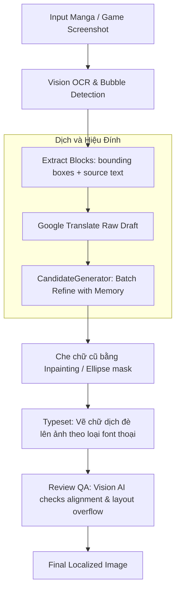

# DRS v3 Localization Workflow Guide

This document describes the workflow stages for both **Novel (text)** and **Manga (image/layout)** translation pipelines.

---

## 1. The Core Translation & Review Pipeline

For any text block or novel chapter, the `Orchestrator` executes the following sequential steps:

```mermaid
sequenceDiagram
    autonumber
    participant U as Streamlit UI
    participant O as Orchestrator / Pipeline
    participant C as CandidateGenerator
    participant S as CheckSuite
    participant R as Reviewer
    participant G as ApprovalGate

    U->>O: run(source_text)
    activate O
    O->>C: generate()
    C->>C: Call Google Translate (Raw Draft)
    C->>C: LLM refinement with Memory & Prompts Mod
    C-->>O: Return GenerationResult
    deactivate C
    
    O->>S: run() checks
    S-->>O: Return CheckReport (issues/flags)
    
    alt Has Issues
        O->>R: review(draft, check_report)
        R-->>O: Return ReviewResult (revised draft)
    else No Issues
        O->>O: Skip Reviewer Pass
    end
    
    O->>G: create_session()
    G-->>U: Await human review
    deactivate O
```

### Phase 1: Hybrid Generation
* **Google Translate Draft**: The text is immediately sent to the Google Translate API. This generates a very fast raw translation.
* **LLM Refinement**: The raw translation is combined with the original text, the Project Memory (Glossary, Entities, Style Guidelines), and the matching prompt mod. The LLM revises the draft to correct stylistic flow, terminology, and formatting.

### Phase 2: Automated Consistency Checks
* The `CheckSuite` verifies the refined draft against:
  * **Glossary rules**: verifies that all approved glossary matches are correctly translated.
  * **Entity list**: verifies correct naming conventions and pronouns.
  * **Style rules**: checks for capitalization, banned terms, or generic violations.

### Phase 3: AI Self-Correction (Reviewer)
* If the `CheckSuite` flags any violations, the `Reviewer` takes the draft and the issue report to fix all fixable errors and adjust soft style inconsistencies.

### Phase 4: Human Approval Gate & Auto-Promoting Memory
* The revised text is presented to the human reviewer in the UI.
* Any edits made by the human are compared against the initial draft.
* **Auto-Promotion**: Any corrections to terms or characters are automatically extracted and appended to the Glossary/Entity lists for future translations.

---

## 2. Manga & Visual Novel Image Translation Pipeline

For visual layouts (manga pages, game screenshots, etc.), the pipeline combines visual analysis with text orchestration:



### 1. Vision OCR & Layout Analysis
* **Bubble / Name Box Detection**: Vision LLM identifies the coordinates of all text frames.
* **Text Extraction**: OCR reads the source Japanese/Chinese text.
* **Bubble Classification**: Categorizes bubbles (`normal`, `thought`, `scream`, `narration`) to map font properties (Times, Comic Sans, Italic, Bold, etc.).

### 2. Batch Translation Refinement
* The text blocks are grouped and sent to `CandidateGenerator` for batch refinement against Project Memory.
* **Background Research**: While typesetting is prepared, `FandomResearcher` runs in the background, queries Wikipedia for any unknown proper nouns, and seeds them into the glossary.

### 3. Rendering & Visual QA
* **Speech Bubble Redrawing**: The old text is cleared (inpainting).
* **Typesetting**: The refined translation is wrapped and drawn inside the bubble boundary boxes using the appropriate font style.
* **Layout QA**: A Vision AI agent reviews the output image to ensure text doesn't overflow bubble margins or clash with background layouts.
